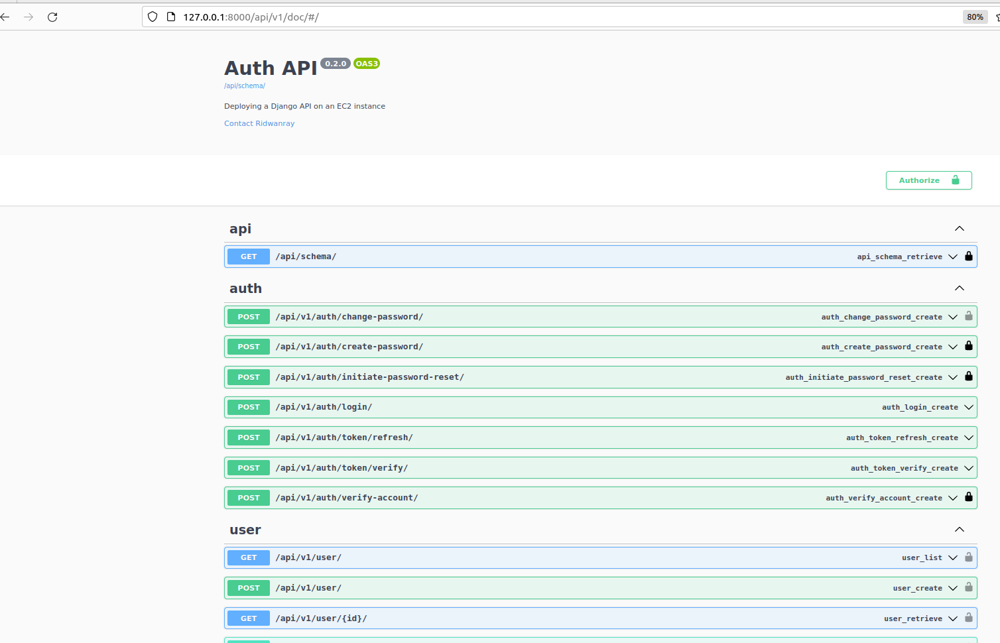
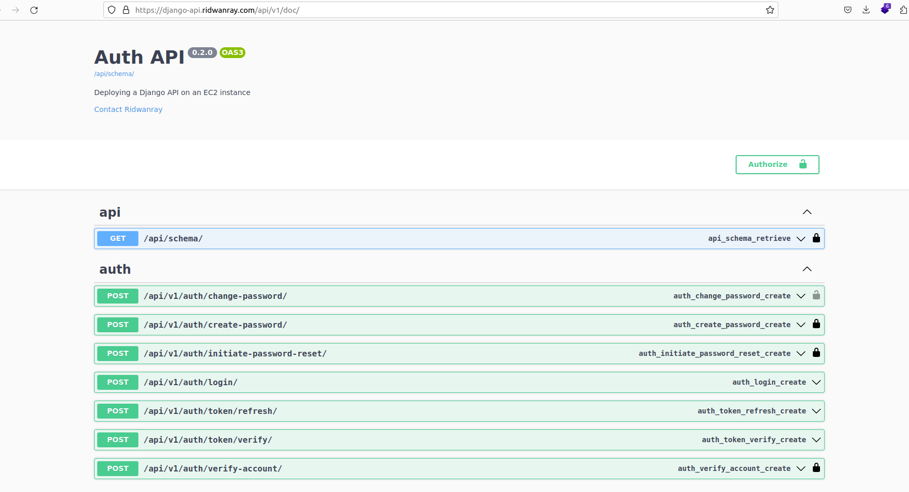
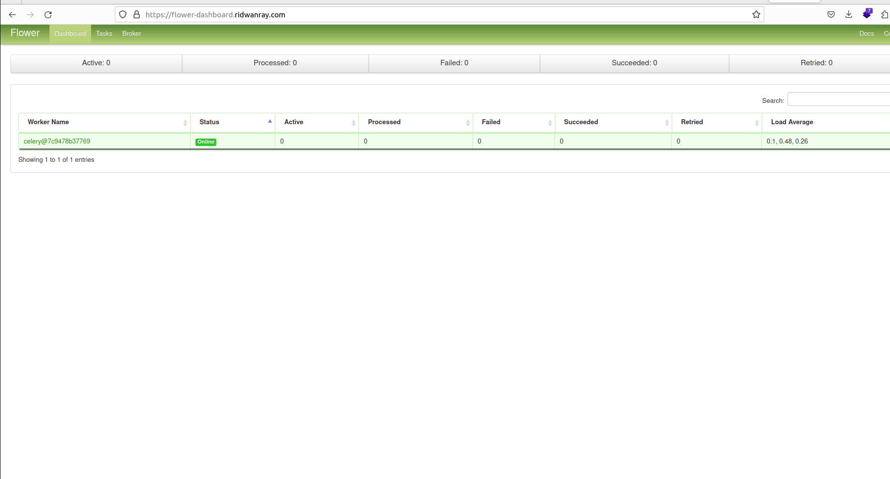

# Django API deployment to AWS EC2 instance
This guide offers hands-on experience in deploying a Django API to an AWS EC2 instance.

Although the guide uses an EC2 instance, the knowledge gained here 
can be transferred to any server instance

## Tools & Services:
- Django & DRF : for building the APIs
- Docker & Docker compose: Containerization
- Celery: For running background task
- Rabbit MQ: A message broker for celery
- Nginx:Reverse proxy
- Letsencrypt & Certbot:SSL certificate
- gunicorn:Production ready web server for python/djang0
- Flower dashboard: For monitoring celery background tasks
- PostgreSQL: Relational DB


## By the end of this tutorial

- We would be able to deploy a Django api running at ap1.example.com
- Flower dashboard for monitoring celery background task at dashboard.example.com

## Running locally

Create a .env file by copying the .env.sample provided and run:
```
docker compose build && docker compose up
```
to start the container. As an alternative, run:
```
docker compose -f docker-compose.dev.yml up --build
```
to build and run the container using the dev yaml file.
Make sure to externalize the db instance to be used. It can be in another container.

## Run tests
Run descriptive tests in the container using:
```
docker compose exec <docker_container_name> pytest -rP -vv
```

Access the docs on:

```
http://localhost:8000/api/v1/doc
```


## Running In a Virtual Env

Create a virtual environment using:
```
mkvirtualenv <env_name>
```

Ensure you have installed `virtualenv` on your system and install dev dependencies using
```
pip install -r app/requirements/dev.txt
```

Navigate to app directory and run migrations using:
```
python manage.py makemigrations

python manage.py migrate
```

Run the server using:
```
python manage.py runserver
```

#  Generating Fixtures (Seeding Roles)

## Roles:
- Superadmin
- Admin


Load roles needed in app into the db

```bash
python manage.py loaddata */fixtures/*.json
```

Export Roles from db

```sh
python manage.py dumpdata  --format=json user.Role -o core/fixtures/Role.json
```


Access docs:
```sh
http://localhost:8000/api/v1/doc
```




## Deployed API


## Flower dashboard

